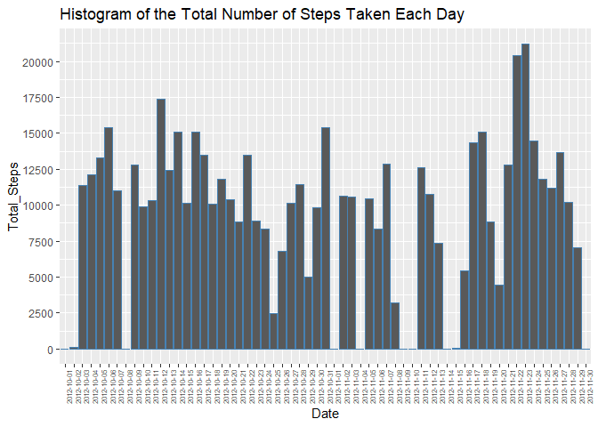
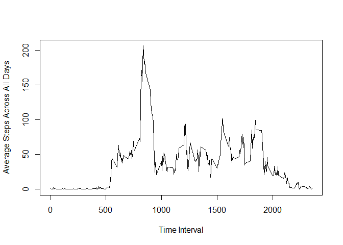
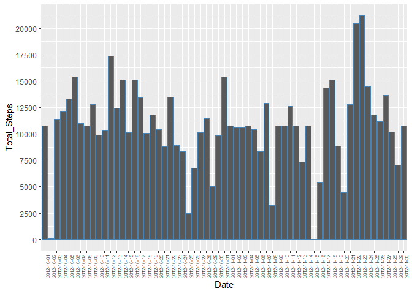
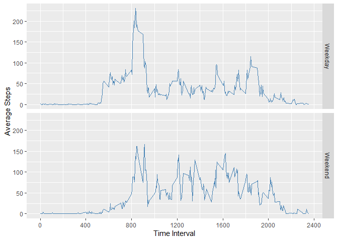

## Loading and preprocessing the data

```
## 
## Attaching package: 'dplyr'
```

```
## The following objects are masked from 'package:stats':
## 
##     filter, lag
```

```
## The following objects are masked from 'package:base':
## 
##     intersect, setdiff, setequal, union
```


## What is mean total number of steps taken per day?

```r
StepSums <- aggregate(Data$steps, by = list('Date' = Data$'date'), sum, na.rm=TRUE) %>% mutate(x = as.numeric(x)) %>% rename("Total_Steps" = x)
# We sum the total steps according to date

g <- ggplot(StepSums, aes(x = Date, y = Total_Steps))
g + geom_bar(stat ='identity', color = "steel blue") + 
  ggtitle("Histogram of the Total Number of Steps Taken Each Day") +
  theme(axis.text.x = element_text(size=6, angle=90)) +
  scale_y_continuous(breaks = c(0, 2500, 5000, 7500, 10000, 12500, 15000, 17500, 20000))
```

<!-- -->

```r
# Then we plot a histogram

stepMean <- mean(StepSums$Total_Steps)
stepMedian <- median(StepSums$Total_Steps)
```
The mean number of steps taken per day (to two decimal places) is 9354.23. The median number of steps taken per day is 1.0395\times 10^{4}.

## What is the average daily activity pattern?

```r
IntMean <- aggregate(Data$steps, by = list('Interval' = Data$'interval'), mean, na.rm=TRUE) %>% mutate(x = as.numeric(x)) %>% rename("Average_Steps" = x) 
#We perform an average of the number of steps over the interval they occur in.

with(IntMean, plot(x=Interval, y=Average_Steps, xlab = "Time Interval",
                   ylab = "Average Steps Across All Days",  type = 'l'))
```

<!-- -->

```r
# Then we plot a time series graph to show the result.

StepMax <- max(IntMean$Average_Steps)
. <- grep(paste("^(", StepMax , ")$", sep = ""), IntMean$Average_Steps)
IntMax <- as.numeric(IntMean$Interval[[.]])
```
The five-minute interval of the day with the maximum number of steps on average is 835.

## Imputing missing values

```r
naSum <- as.numeric(sum(is.na(Data$steps)))
```
The total number of missing values in the dataset is 2304. To fill in these missing values, we will replace any NA values with the average number of steps in that time interval across all days, as calculated in step 2.

```r
newData <- Data # We take a copy of the original dataset
for(i in 1:length(Data$steps)){
  if(is.na(newData$steps[[i]])){ # Then, where we find a missing value...
    d <- Data$interval[[i]]
    j <- grep(paste("^(", d , ")$", sep = ""), IntMean$Interval)
    newData$steps[[i]] <- IntMean$Average_Steps[[j]] # ...we replace it with the 
   } # average result.
}

StepSums2 <- aggregate(newData$steps, by = list('Date' = newData$'date'), sum, na.rm=TRUE) %>% mutate(x = as.numeric(x)) %>% rename("Total_Steps" = x) 
# We repeat the process of summing the data as in step one.

g3 <- ggplot(StepSums2, aes(x = Date, y = Total_Steps))
g3 + geom_bar(stat ='identity', color = "steel blue") +
  theme(axis.text.x = element_text(size=6, angle=90)) +
  scale_y_continuous(breaks = c(0, 2500, 5000, 7500, 10000, 12500, 15000, 17500, 20000))
```

<!-- -->

```r
# We plot a new version of the daily total steps.

stepMean2 <- mean(StepSums2$Total_Steps)
stepMedian2 <- median(StepSums2$Total_Steps)
```
Now (to two decimal places) the mean number of steps taken per day is 1.076619\times 10^{4} and the median number of steps taken per day is 1.076619\times 10^{4}, increasing them both. The impact on the new estimated total number of daily steps is to generally increase the sums and significantly increase them in the cases of dates that have mostly missing values.

## Are there differences in activity patterns between weekdays and weekends?


```r
WeekData <- newData %>% mutate(Day = weekdays(as.Date(date)))
# First we catogarize the dates according to day of the week.
wend <- c("Saturday", "Sunday")
wday <- c("Monday", "Tuesday", "Wednesday", "Thursday", "Friday")

WeekData <- WeekData %>% mutate(tempCol = replace(Day, Day %in% wend, "Weekend")) %>% mutate(Period = factor(replace(tempCol, tempCol %in% wday, "Weekday"))) %>% select(steps, date, interval, Period)
# Next we replace Day with the factor Period, which indicates whether the date took place on a weekday or at the weekend.

IntMean2 <- aggregate(WeekData$steps, by = list('Interval' = WeekData$interval, 'Period' = WeekData$Period), mean) %>% mutate(x = as.numeric(x)) %>% rename("Average_Steps" = x)
# Then we perform a similar averaging process to step 2, but across the two different periods of weekdays and weekends.

g4 <- ggplot(IntMean2, aes(x = Interval, y = Average_Steps))
print(g4 + geom_line(lwd = 0.1, color = "steel blue") + facet_grid(Period~.) + xlab("Time Interval") + ylab("Average Steps") + scale_x_continuous(breaks=seq(0, 2400, 400)))
```

<!-- -->

```r
# Finally we print a time series graph, divided into two panels by the Period factor.
```


